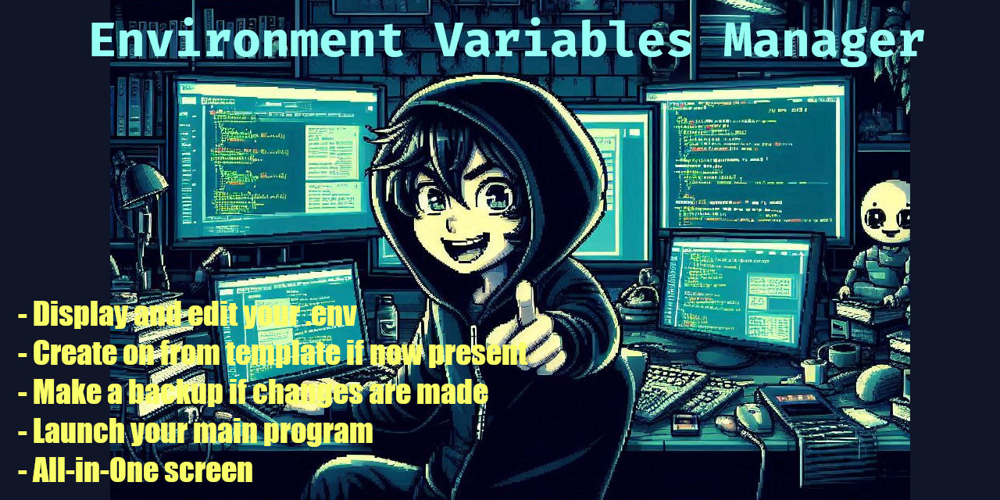
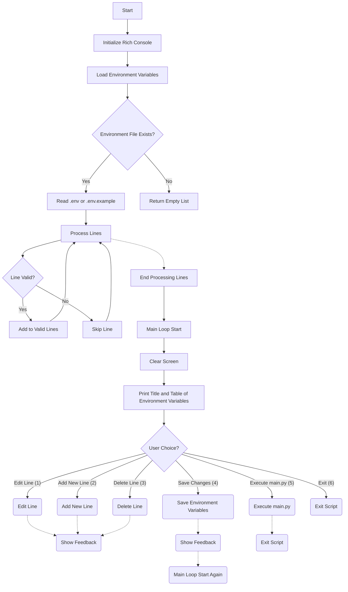

# README.md



---

## [.env] Environment Master Manager

### Overview

**.env MasterManager** is a command-line tool designed to manage environment variables stored in `.env` files. It provides a user-friendly interface for editing, adding, deleting, and saving environment variables directly from the terminal.

I made this because while testing which LLM model model worked the best for a project, I find myself opening .env file
before nearly each program run, to verify my settings where right, no API key was missing. Quit the text editor and 
executed the main program.  

This is a shortcut. `manager.py` loads the .env file, sort the list of entry, remove empty lines, remove commentaries and  
display them. If no .env is found, create a new one from a template. Let you edit, add, delete and save your change (it makes a backup of the current .env file before applying the changes if you want to go back). You can hit `Execute Main` to launch
your program using your new config. 

All of this in a simple CLI screen.  

I use this for all my scripts that are using a `.env` file. All you have to change is the filename of the main program in
the script and it is good to go.

---

## Flowchart



---

### Features
- **Load .env File:** Automatically loads the `.env` file or falls back to `.env.example` if the primary file does not exist.
- **Edit Lines:** Modify existing environment variable entries.
- **Add New Lines:** Add new environment variable entries.
- **Delete Lines:** Remove unwanted environment variable entries.
- **Save Changes:** Save modifications to the `.env` file with automatic backup creation.
- **Execute Script:** Run `main.py` after making changes.

---

### Installation

1. Clone the repository:

   ```bash
   git clone https://github.com/TheRealFREDP3D/EvironmentMasterManager.git
   ```

---

2. Navigate to the project directory:

   ```bash
   cd EnvironmentMasterManager
   ```

---

3. Install dependencies (Rich library):

   ```bash
   pip install rich
   ```

---

### Usage

#### Running .env MasterManager

```bash
python manager.py
```

---

#### Main Menu Options

1. **Edit Line:**
   - Select this option to modify an existing environment variable entry by entering its line number and providing a new value.

2. **Add New Line:**
   - Choose this option to add a new environment variable entry by entering the full line (e.g., `API_KEY=your_api_key_here`).

3. **Delete Line:**
   - Use this option to remove an unwanted environment variable entry by specifying its line number.

4. **Save Changes:**
   - Save all your modifications to the `.env` file, creating a backup of the original file as `.env.bak`.

5. **Execute main.py:**
   - Run your main script (`main.py`) after making any necessary changes.

6. **Exit:**
   - Exit the program without saving any changes.

---

### Notes

- The tool skips lines that are empty or start with specific characters such as spaces, comments (`#`), newlines (`\n`), or tabs (`\t`).
- Error messages and feedback are displayed using Rich Console for better readability and styling.

---

### Authorship

**Author:** Frederick Pellerin  
**Email:** fredp3d@proton.me  
**GitHub:** [TheRealFREDP3D](https://github.com/TheRealFREDP3D/)  
**Twitter/X:** [@TheRealFredP3D](https://x.com/TheRealFredP3D/)

---

Feel free to contribute to or report issues on [GitHub](https://github.com/TheRealFREDP3D/EvironmentMasterManager).